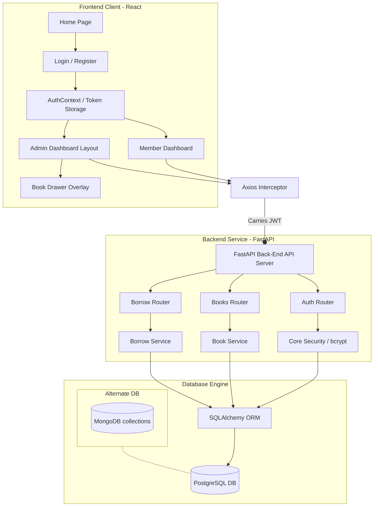

<div align="center">

# 📚 Library Management System

**A production-ready, full-stack library management platform** built with **FastAPI**, **React**, and **PostgreSQL** — featuring real-time circulation analytics, role-based admin tooling, and a polished, mobile-responsive interface.

[](https://fastapi.tiangolo.com/)
[](https://react.dev/)
[](https://www.postgresql.org/)
[](https://www.mongodb.com/)
[](https://vitejs.dev/)
[](https://jwt.io/)
[](https://vercel.com/)
[](https://render.com/)
[](https://neon.tech/)
[](http://makeapullrequest.com)

</div>

---

## 📖 Table of Contents

- [Overview](#-overview)
- [Key Features](#-key-features)
- [Technology Stack](#️-technology-stack)
- [Folder Structure](#-folder-structure)
- [Database Architecture](#️-database-architecture)
- [Environment Variables](#️-environment-variables)
- [Installation & Local Setup](#-installation--local-setup)
- [API Documentation](#-api-documentation)
- [Project Architecture](#-project-architecture)
- [Usage Guide](#-usage-guide)
- [Deployment](#-deployment)
  - [Database — Neon](#1️⃣-database--neon-postgresql)
  - [Backend — Render](#2️⃣-backend--render)
  - [Frontend — Vercel](#3️⃣-frontend--vercel)
  - [Docker Compose (Self-Hosted)](#-alternative-docker-compose-self-hosted)

---

## 🌟 Overview

This Library Management System bridges the gap between **administrators (librarians)** and **members (readers)**. Admins get a powerful, SaaS-style panel to manage inventory, monitor circulation, and analyze borrowing trends — while members get a clean dashboard for browsing the catalog, borrowing books, and tracking their reading history.

The backend is built on **FastAPI's async architecture** with **JWT-based authentication**, using **SQLAlchemy** to interface with PostgreSQL. The data layer is modular enough to map cleanly onto **MongoDB collections** for teams preferring a NoSQL stack.

---

## ⚡ Key Features

### 👤 Member Experience
- **Live Dashboard** — real-time gauges for active borrows, overdue items, and total books read
- **Searchable Catalog** — filterable book table with title, author, category, ISBN, and live availability badges
- **One-Click Borrowing** — instant availability checks with automatic due-date calculation
- **Borrow History** — chronological log with status indicators and one-click returns
- **Profile Access** — view account details, role, and registration date

### 🛠️ Admin Panel
- **Dedicated Admin Layout** — sidebar navigation with profile card and quick links to dashboard & catalog tools
- **Circulation Analytics** — stat cards for total books, active loans, available copies, and overdue rate
- **Visual Progress Gauges** — circular/bar charts breaking down circulation health
- **Inline Book Editor** — sliding drawer overlay to add/edit books without leaving the catalog view
- **Filtering & Pagination** — filter by availability/category, paginate by 5, 10, or 25 entries
- **Role-Gated Access** — all admin routes protected via JWT role validation

---

## 🛠️ Technology Stack

| Layer | Technologies |
|---|---|
| **Frontend** | React 19 (Vite) · React Router DOM v7 · Axios · React Icons |
| **Backend** | FastAPI · Uvicorn (ASGI) · SQLAlchemy · Pydantic v2 |
| **Auth** | JWT (JSON Web Tokens) · Passlib (bcrypt) |
| **Database** | PostgreSQL (active) · MongoDB (NoSQL-compatible schema) |
| **Styling** | CSS variables · Glassmorphism gradients · CSS transitions |

---

## 📂 Folder Structure

```text
library-management/
├── backend/
│   ├── app/
│   │   ├── api/                  # FastAPI routers
│   │   │   ├── admin.py
│   │   │   ├── auth.py
│   │   │   ├── books.py
│   │   │   ├── borrow.py
│   │   │   └── user_dashboard.py
│   │   ├── core/                 # Config, DB sessions, security
│   │   │   ├── config.py
│   │   │   ├── database.py
│   │   │   └── security.py
│   │   ├── models/                # SQLAlchemy models
│   │   │   ├── book.py
│   │   │   ├── borrow.py
│   │   │   └── user.py
│   │   ├── schemas/                # Pydantic validation schemas
│   │   │   ├── admin.py
│   │   │   ├── book.py
│   │   │   ├── borrow.py
│   │   │   └── user.py
│   │   ├── services/               # Business logic
│   │   │   ├── admin_service.py
│   │   │   ├── auth_service.py
│   │   │   ├── book_service.py
│   │   │   └── borrow_service.py
│   │   └── main.py                 # FastAPI entry point
│   ├── tests/
│   │   └── test_main.py
│   ├── requirements.txt
│   └── .env
│
├── frontend/
│   ├── public/
│   │   ├── favicon.svg
│   │   └── icons.svg
│   ├── src/
│   │   ├── api/
│   │   │   └── axios.js            # Pre-configured Axios client
│   │   ├── assets/
│   │   ├── components/
│   │   │   └── layout/
│   │   │       ├── AdminLayout.jsx
│   │   │       ├── Navbar.jsx
│   │   │       └── ProtectedRoute.jsx
│   │   ├── context/
│   │   │   ├── AuthContext.jsx
│   │   │   └── ToastContext.jsx
│   │   ├── hooks/
│   │   │   ├── useAuth.js
│   │   │   └── useToast.js
│   │   ├── pages/
│   │   │   ├── Dashboard.jsx
│   │   │   ├── Home.jsx
│   │   │   ├── Login.jsx
│   │   │   ├── NotFound.jsx
│   │   │   ├── Profile.jsx
│   │   │   ├── Register.jsx
│   │   │   ├── admin/
│   │   │   │   ├── AdminDashboard.jsx
│   │   │   │   └── ManageBooks.jsx
│   │   │   ├── books/
│   │   │   │   ├── BookDetails.jsx
│   │   │   │   └── Books.jsx
│   │   │   └── borrow/
│   │   │       ├── BorrowBook.jsx
│   │   │       └── BorrowHistory.jsx
│   │   ├── routes/
│   │   │   └── AppRoutes.jsx
│   │   ├── styles/
│   │   │   ├── admin.css
│   │   │   ├── books.css
│   │   │   ├── dashboard.css
│   │   │   ├── global.css
│   │   │   ├── login.css
│   │   │   └── navbar.css
│   │   ├── utils/
│   │   └── main.jsx
│   ├── package.json
│   ├── vite.config.js
│   └── eslint.config.js
```

---

## 🗄️ Database Architecture

<details>
<summary><strong>PostgreSQL Tables (Active)</strong> — click to expand</summary>

#### `users`
```sql
CREATE TABLE users (
    id SERIAL PRIMARY KEY,
    name VARCHAR(100) NOT NULL,
    email VARCHAR(255) UNIQUE NOT NULL,
    password_hash TEXT NOT NULL,
    role VARCHAR(20) DEFAULT 'member' NOT NULL,
    created_at TIMESTAMP DEFAULT CURRENT_TIMESTAMP
);
```

#### `books`
```sql
CREATE TABLE books (
    id SERIAL PRIMARY KEY,
    title VARCHAR(255) NOT NULL,
    author VARCHAR(150) NOT NULL,
    isbn VARCHAR(20) UNIQUE NOT NULL,
    category VARCHAR(100),
    published_year INTEGER,
    total_copies INTEGER NOT NULL,
    available_copies INTEGER NOT NULL,
    created_at TIMESTAMP DEFAULT CURRENT_TIMESTAMP
);
```

#### `borrow_records`
```sql
CREATE TABLE borrow_records (
    id SERIAL PRIMARY KEY,
    user_id INTEGER REFERENCES users(id) ON DELETE CASCADE,
    book_id INTEGER REFERENCES books(id) ON DELETE CASCADE,
    borrow_date TIMESTAMP DEFAULT CURRENT_TIMESTAMP,
    due_date TIMESTAMP NOT NULL,
    return_date TIMESTAMP,
    status VARCHAR(50) DEFAULT 'Borrowed'
);
```

</details>

<details>


#### `users`
```json
{
  "_id": "ObjectId",
  "name": "string (Full Name)",
  "email": "string (Unique Index)",
  "password_hash": "string (Bcrypt hashed password)",
  "role": "string ('member' or 'admin')",
  "created_at": "ISODate"
}
```

#### `books`
```json
{
  "_id": "ObjectId",
  "title": "string",
  "author": "string",
  "isbn": "string (Unique Index)",
  "category": "string",
  "published_year": "int",
  "total_copies": "int",
  "available_copies": "int",
  "created_at": "ISODate"
}
```

#### `borrow_records`
```json
{
  "_id": "ObjectId",
  "user_id": "ObjectId (Reference to users collection)",
  "book_id": "ObjectId (Reference to books collection)",
  "borrow_date": "ISODate",
  "due_date": "ISODate",
  "return_date": "ISODate (Nullable)",
  "status": "string ('Borrowed' or 'Returned')"
}
```

</details>

---

## ⚙️ Environment Variables

**Backend** — create a `.env` file inside `/backend`:
```env
DATABASE_URL=postgresql://<username>:<password>@localhost:5432/library_db
SECRET_KEY=your_super_secret_signing_key_for_jwt
ALGORITHM=HS256
ACCESS_TOKEN_EXPIRE_MINUTES=30
```

**Frontend** — create a `.env` file inside `/frontend` (Vite requires the `VITE_` prefix):
```env
VITE_API_URL=http://localhost:8000
```

---

## 🚀 Installation & Local Setup

### Prerequisites
| Requirement | Version |
|---|---|
| Python | 3.10+ |
| Node.js | 18.0+ (with npm) |
| PostgreSQL | Local or cloud instance |

### 1. Backend Setup
```bash
cd backend

# Create and activate a virtual environment
python -m venv .venv
# Windows (PowerShell)
.venv\Scripts\Activate.ps1
# Linux/macOS
source .venv/bin/activate

# Install dependencies
pip install -r requirements.txt

# Ensure PostgreSQL is running and a `library_db` database exists, then:
uvicorn app.main:app --reload
```
API docs will be available at **`http://localhost:8000/docs`**.

### 2. Frontend Setup
```bash
cd frontend
npm install
npm run dev
```
The app will be available at **`http://localhost:5173/`** (or `5174` if `5173` is in use).

---

## 🔌 API Documentation

| Tag | Method | Endpoint | Auth | Role | Payload | Response |
|---|---|---|---|---|---|---|
| Auth | `POST` | `/auth/register` | No | Any | `UserCreate` | `UserResponse` |
| Auth | `POST` | `/auth/login` | No | Any | `UserLogin` | `Token` |
| Auth | `GET` | `/auth/me` | Yes | Any | — | `UserResponse` |
| Books | `POST` | `/books` | Yes | Admin | `BookCreate` | `BookResponse` |
| Books | `GET` | `/books` | Yes | Any | — | `List[BookResponse]` |
| Books | `GET` | `/books/{book_id}` | Yes | Any | — | `BookResponse` |
| Books | `PUT` | `/books/{book_id}` | Yes | Admin | `BookCreate` | `BookResponse` |
| Books | `DELETE` | `/books/{book_id}` | Yes | Admin | — | `{ "message": "Book deleted successfully." }` |
| Borrow | `POST` | `/borrow` | Yes | Any | `BorrowCreate` | `BorrowResponse` |
| Borrow | `PUT` | `/borrow/return/{borrow_id}` | Yes | Any | — | `BorrowResponse` |
| Borrow | `GET` | `/borrow` | Yes | Any | — | `List[BorrowResponse]` |
| User | `GET` | `/user/dashboard` | Yes | Any | — | `UserDashboardResponse` |
| Admin | `GET` | `/admin/dashboard` | Yes | Admin | — | `DashboardResponse` |

> Full interactive documentation is auto-generated by FastAPI and available at `/docs` once the backend is running.

---

## 📈 Project Architecture



---

## 📖 Usage Guide

### Admin Workflow
1. Register a new account via the standard registration page.
2. Promote the account to `admin` by updating its `role` in the `users` table (via psql or pgAdmin).
3. Log in with the admin account — you'll be routed automatically to `/admin`.
4. Use the sidebar to view circulation metrics or manage the **Books Catalog** (add, edit, adjust copies, filter).

### Member Workflow
1. Register and log in.
2. Browse the catalog from the **Member Dashboard**.
3. Click **Borrow** on any book marked "In Stock."
4. Track active borrows from your dashboard and return them before the due date to avoid overdue status.

---

## 📦 Deployment

The recommended production setup uses three free-tier-friendly managed services: **Neon** for the database, **Render** for the API, and **Vercel** for the frontend.

| Layer | Service | Why |
|---|---|---|
| Database | [Neon](https://neon.tech/) | Serverless PostgreSQL, generous free tier, instant branching |
| Backend | [Render](https://render.com/) | Free-tier web services with native Python/Uvicorn support |
| Frontend | [Vercel](https://vercel.com/) | Zero-config static hosting + CI/CD for Vite/React builds |

### 1️⃣ Database — Neon (PostgreSQL)

1. Create a free account at [neon.tech](https://neon.tech/) and spin up a new project.
2. Create a database (e.g. `library_db`) inside the project.
3. From the Neon dashboard, copy the **pooled connection string** — it will look like:
   ```text
   postgresql://<user>:<password>@<endpoint>.neon.tech/library_db?sslmode=require
   ```
4. Keep this connection string handy — it becomes your backend's `DATABASE_URL`.
5. Neon databases auto-suspend when idle and resume on the next connection, so no manual scaling is required for a portfolio-scale app.

### 2️⃣ Backend — Render

1. Push your repository to GitHub (if not already done).
2. On [render.com](https://render.com/), select **New → Web Service** and connect your repo.
3. Configure the service:

   | Setting | Value |
   |---|---|
   | **Root Directory** | `backend` |
   | **Runtime** | Python 3 |
   | **Build Command** | `pip install -r requirements.txt` |
   | **Start Command** | `uvicorn app.main:app --host 0.0.0.0 --port $PORT` |

4. Add the following environment variables under **Environment**:
   ```env
   DATABASE_URL=<your Neon pooled connection string>
   SECRET_KEY=<a strong, unique production secret>
   ALGORITHM=HS256
   ACCESS_TOKEN_EXPIRE_MINUTES=30
   ```
5. Deploy. Render will build and expose your API at a URL like:
   ```text
   https://library-management-api.onrender.com
   ```
6. Verify it's live by visiting `https://<your-render-url>/docs`.

> 💡 Render's free tier spins down after inactivity, so the first request after idle time may take a few seconds to wake the service — expected behavior, not a bug.

### 3️⃣ Frontend — Vercel

1. On [vercel.com](https://vercel.com/), select **Add New → Project** and import the same GitHub repo.
2. Configure the project:

   | Setting | Value |
   |---|---|
   | **Root Directory** | `frontend` |
   | **Framework Preset** | Vite |
   | **Build Command** | `npm run build` |
   | **Output Directory** | `dist` |

3. Add an environment variable so the frontend points to your live API:
   ```env
   VITE_API_URL=https://library-management-api.onrender.com
   ```
4. Deploy. Vercel will provide a live URL such as:
   ```text
   https://library-management.vercel.app
   ```
5. Every push to your default branch automatically triggers a new Vercel deployment.

### ✅ Post-Deployment Checklist
- [ ] Confirm `https://<render-url>/docs` loads the FastAPI Swagger UI
- [ ] Confirm the Vercel app can register/login successfully (check browser network tab for CORS errors)
- [ ] Add your Vercel domain to the backend's CORS `allow_origins` list in `app/main.py`
- [ ] Promote a test account to `admin` directly in Neon's SQL editor to verify the admin panel

---

### 🐳 Alternative: Docker Compose (Self-Hosted)

For local or self-hosted deployments without third-party platforms:

```bash
# 1. Ensure Docker and Docker Compose are installed
# 2. Populate production values in your .env files
# 3. Build and launch all services
docker-compose up -d --build
```

This spins up the PostgreSQL database, runs schema migrations, starts the FastAPI backend, and serves the production-built React frontend.

---

<div align="center">

Built with FastAPI, React, PostgreSQL · Deployed on Vercel, Render & Neon

</div>
