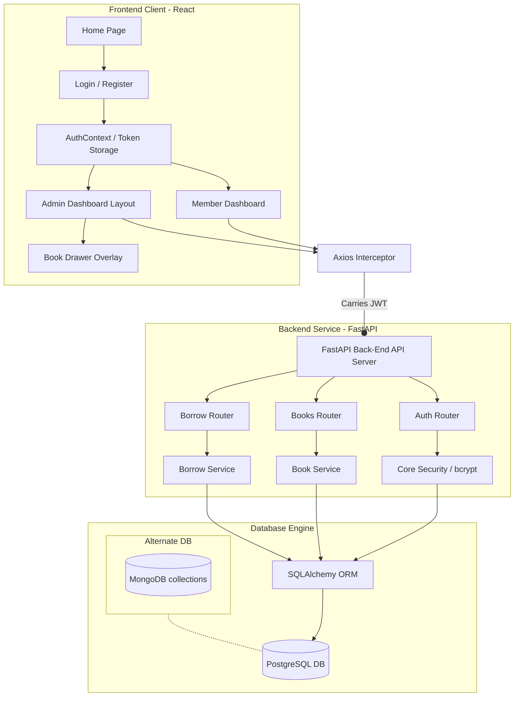

# 📚 Library Management System

A production-ready, high-performance, and beautifully designed **Library Management System** built with **FastAPI** (Python), **React** (Vite + JavaScript), and a robust **PostgreSQL** database (integrated with equivalent **MongoDB** collection schemas for modern flexibility). 

Featuring a sleek dark-slate theme, real-time statistics gauges, a mobile-responsive dashboard layout, client-side pagination, collapsible inventory drawers, and custom-styled responsive tables.

---

## 📖 Table of Contents
1. [Project Overview](#-project-overview)
2. [Key Features](#-key-features)
3. [Technology Stack](#-technology-stack)
4. [Folder Structure](#-folder-structure)
5. [Database Architecture](#-database-architecture)
   - [PostgreSQL Tables (Active)](#postgresql-tables-active)
   - [MongoDB Collections (Conceptual Equivalent)](#mongodb-collections-conceptual-equivalent)
6. [Environment Variables](#-environment-variables)
7. [Installation & Local Setup](#-installation--local-setup)
   - [Prerequisites](#prerequisites)
   - [Backend Configuration](#1-backend-configuration)
   - [Frontend Configuration](#2-frontend-configuration)
8. [API Documentation (Endpoints)](#-api-documentation-endpoints)
9. [Project Workflow & Architecture](#-project-workflow--architecture)
10. [Usage Instructions](#-usage-instructions)
11. [Deployment Guide](#-deployment-guide)

---

## 🌟 Project Overview

This Library Management System is designed to bridge the gap between administrators (librarians) and members (readers). It provides administrators with a powerful **SaaS-like Admin Panel** to manage book inventories, track system circulations, and analyze borrowing metrics. On the other hand, members get a clean dashboard, book catalog search, real-time availability badges, and a borrowing history manager.

The backend leverages **FastAPI's asynchronous speed**, standardizing communication via JWT-based token authentication. The database layer utilizes **SQLAlchemy** to interface with PostgreSQL, but it is modular enough to easily map to **MongoDB collections** if a NoSQL stack is preferred.

---

## ⚡ Key Features

### 👤 Member Interface
- **Dashboard Summary**: Real-time card gauges displaying the number of active books borrowed, overdue returns, and overall read count.
- **Book Catalog**: Searchable book table listing titles, authors, categories, ISBNs, and live availability badges ("In Stock" vs. "Out of Stock").
- **Borrowing Flow**: Integrated borrow-action buttons with instant availability calculation and automatic due-date offsets.
- **Borrow History**: Clean chronological logs detailing borrow dates, due dates, custom status indicators, and one-click return mechanics.
- **User Profile**: Access and inspect logged-in credentials (name, email, role, date registered).

### 🛠️ Admin Panel & Inventory Dashboard
- **Unified Admin Layout**: Sleek left navigation sidebar featuring admin profile cards and navigation routes for dashboard statistics and book catalog editing.
- **Advanced Stat Grid**: Heavyweight numerical cards showing total books, active loans, available copies, and overdue rates.
- **HTML/CSS Progress Gauges**: Visual circular/bar percentage breakdown of system circulations.
- **Book Drawer Overlay**: A modern sliding overlay form to add or edit books without leaving the catalog table.
- **Pagination & Filters**: Advanced client-side dropdown filtering (by availability & category) and pagination support (5, 10, or 25 entries per page).
- **Secure Access Control**: Global JWT-based admin-role validation.

---

## 🛠️ Technology Stack

### Frontend
- **Framework**: React 19 (Vite compilation build system)
- **Routing**: React Router DOM v7
- **Styling**: Modern CSS variables, Glassmorphism gradients, and CSS transitions.
- **Networking**: Axios (configured with interceptors to automatically forward JWT headers)
- **Icons**: React Icons (Lucide / Bootstrap style vectors)

### Backend
- **Core Framework**: FastAPI (ASGI Python web server)
- **Server Engine**: Uvicorn
- **ORM**: SQLAlchemy
- **Authentication**: JWT (JSON Web Tokens), `passlib` (bcrypt hashing)
- **Validation**: Pydantic v2 schemas

### Database
- **Active Setup**: **PostgreSQL** (mapped using SQLAlchemy models)
- **NoSQL Alternative**: **MongoDB** (JSON schemas provided for document collections mapping)

---

## 📂 Folder Structure

```text
library-management/
├── backend/
│   ├── app/
│   │   ├── __init__.py
│   │   ├── api/                  # FastAPI routers (Endpoints)
│   │   │   ├── admin.py
│   │   │   ├── auth.py
│   │   │   ├── books.py
│   │   │   ├── borrow.py
│   │   │   └── user_dashboard.py
│   │   ├── core/                 # Core configs, DB sessions, security
│   │   │   ├── config.py
│   │   │   ├── database.py
│   │   │   └── security.py
│   │   ├── models/               # SQLAlchemy Models (DB Schemas)
│   │   │   ├── book.py
│   │   │   ├── borrow.py
│   │   │   └── user.py
│   │   ├── schemas/              # Pydantic validation schemas
│   │   │   ├── admin.py
│   │   │   ├── book.py
│   │   │   ├── borrow.py
│   │   │   └── user.py
│   │   ├── services/             # Core business logic services
│   │   │   ├── admin_service.py
│   │   │   ├── auth_service.py
│   │   │   ├── book_service.py
│   │   │   └── borrow_service.py
│   │   └── main.py               # Main entry point for FastAPI
│   ├── tests/
│   │   └── test_main.py          # API route tests
│   ├── requirements.txt          # Python dependencies
│   └── .env                      # Backend credentials environment file
│
├── frontend/
│   ├── public/                   # Static assets (Favicons, images)
│   │   ├── favicon.svg
│   │   └── icons.svg
│   ├── src/
│   │   ├── api/
│   │   │   └── axios.js          # Pre-configured Axios client instance
│   │   ├── assets/               # Local React assets
│   │   ├── components/
│   │   │   └── layout/
│   │   │       ├── AdminLayout.jsx
│   │   │       ├── Navbar.jsx
│   │   │       └── ProtectedRoute.jsx
│   │   ├── context/
│   │   │   ├── AuthContext.jsx   # Global User Authentication context
│   │   │   └── ToastContext.jsx  # Notification alert context
│   │   ├── hooks/
│   │   │   ├── useAuth.js
│   │   │   └── useToast.js
│   │   ├── pages/
│   │   │   ├── Dashboard.jsx
│   │   │   ├── Home.jsx
│   │   │   ├── Login.jsx
│   │   │   ├── NotFound.jsx
│   │   │   ├── Profile.jsx
│   │   │   ├── Register.jsx
│   │   │   ├── admin/
│   │   │   │   ├── AdminDashboard.jsx
│   │   │   │   └── ManageBooks.jsx
│   │   │   ├── books/
│   │   │   │   ├── BookDetails.jsx
│   │   │   │   └── Books.jsx
│   │   │   └── borrow/
│   │   │       ├── BorrowBook.jsx
│   │   │       └── BorrowHistory.jsx
│   │   ├── routes/
│   │   │   └── AppRoutes.jsx     # Navigation router definitions
│   │   ├── styles/               # Component-specific CSS stylesheets
│   │   │   ├── admin.css
│   │   │   ├── books.css
│   │   │   ├── dashboard.css
│   │   │   ├── global.css
│   │   │   ├── login.css
│   │   │   └── navbar.css
│   │   ├── utils/
│   │   └── main.jsx              # Vite React entry-point script
│   ├── package.json              # NPM manifest dependencies
│   ├── vite.config.js            # Bundler configuration file
│   └── eslint.config.js          # Linter configuration file
```

---

## 🗄️ Database Architecture

### PostgreSQL Tables (Active)
The project utilizes 3 key tables mapped via SQLAlchemy in [database.py](file:///c:/Users/knith/library-management/backend/app/core/database.py):

#### 1. `users` Table
```sql
CREATE TABLE users (
    id SERIAL PRIMARY KEY,
    name VARCHAR(100) NOT NULL,
    email VARCHAR(255) UNIQUE NOT NULL,
    password_hash TEXT NOT NULL,
    role VARCHAR(20) DEFAULT 'member' NOT NULL,
    created_at TIMESTAMP DEFAULT CURRENT_TIMESTAMP
);
```

#### 2. `books` Table
```sql
CREATE TABLE books (
    id SERIAL PRIMARY KEY,
    title VARCHAR(255) NOT NULL,
    author VARCHAR(150) NOT NULL,
    isbn VARCHAR(20) UNIQUE NOT NULL,
    category VARCHAR(100),
    published_year INTEGER,
    total_copies INTEGER NOT NULL,
    available_copies INTEGER NOT NULL,
    created_at TIMESTAMP DEFAULT CURRENT_TIMESTAMP
);
```

#### 3. `borrow_records` Table
```sql
CREATE TABLE borrow_records (
    id SERIAL PRIMARY KEY,
    user_id INTEGER REFERENCES users(id) ON DELETE CASCADE,
    book_id INTEGER REFERENCES books(id) ON DELETE CASCADE,
    borrow_date TIMESTAMP DEFAULT CURRENT_TIMESTAMP,
    due_date TIMESTAMP NOT NULL,
    return_date TIMESTAMP,
    status VARCHAR(50) DEFAULT 'Borrowed'
);
```

---

### MongoDB Collections (Conceptual Equivalent)
If you wish to scale this application using MongoDB, here are the equivalent collections and document schemas:

#### 1. `users` Collection
```json
{
  "_id": "ObjectId",
  "name": "string (Full Name)",
  "email": "string (Unique Index)",
  "password_hash": "string (Bcrypt hashed password)",
  "role": "string ('member' or 'admin')",
  "created_at": "ISODate"
}
```

#### 2. `books` Collection
```json
{
  "_id": "ObjectId",
  "title": "string",
  "author": "string",
  "isbn": "string (Unique Index)",
  "category": "string",
  "published_year": "int",
  "total_copies": "int",
  "available_copies": "int",
  "created_at": "ISODate"
}
```

#### 3. `borrow_records` Collection
```json
{
  "_id": "ObjectId",
  "user_id": "ObjectId (Reference to users collection)",
  "book_id": "ObjectId (Reference to books collection)",
  "borrow_date": "ISODate",
  "due_date": "ISODate",
  "return_date": "ISODate (Nullable)",
  "status": "string ('Borrowed' or 'Returned')"
}
```

---

## ⚙️ Environment Variables

### Backend Configuration
Create a `.env` file inside the `backend` folder:
```env
DATABASE_URL=postgresql://<username>:<password>@localhost:5432/library_db
SECRET_KEY=your_super_secret_signing_key_for_jwt
ALGORITHM=HS256
ACCESS_TOKEN_EXPIRE_MINUTES=30
```

### Frontend Configuration
Vite picks up configurations from files prefixed with `VITE_`. If you need to custom configure your API URL, create an `.env` in the `frontend` folder:
```env
VITE_API_URL=http://localhost:8000
```

---

## 🚀 Installation & Local Setup

### Prerequisites
- **Python**: v3.10 or higher
- **Node.js**: v18.0 or higher (with npm)
- **PostgreSQL**: Local or cloud PostgreSQL instance

### 1. Backend Configuration
1. Open a terminal inside the `/backend` folder:
   ```bash
   cd backend
   ```
2. Create a virtual environment:
   ```bash
   python -m venv .venv
   ```
3. Activate the virtual environment:
   * **Windows (PowerShell)**: `.venv\Scripts\Activate.ps1`
   * **Linux/macOS**: `source .venv/bin/activate`
4. Install all python requirements:
   ```bash
   pip install -r requirements.txt
   ```
5. Ensure your PostgreSQL server is running, and create a database named `library_db`.
6. Run the FastAPI development server:
   ```bash
   uvicorn app.main:app --reload
   ```
   * The documentation will be available locally at `http://localhost:8000/docs`.

### 2. Frontend Configuration
1. Open a terminal inside the `/frontend` folder:
   ```bash
   cd frontend
   ```
2. Install npm dependencies:
   ```bash
   npm install
   ```
3. Launch the Vite developer server:
   ```bash
   npm run dev
   ```
   * The web application will launch at `http://localhost:5174/` or `http://localhost:5173/`.

---

## 🔌 API Documentation (Endpoints)

| Tag | HTTP Method | Endpoint | Auth | Role | Payload (Pydantic Schema) | Response / Description |
|---|---|---|---|---|---|---|
| **Authentication** | `POST` | `/auth/register` | No | Any | `UserCreate` | `UserResponse` (Registers new member/admin) |
| **Authentication** | `POST` | `/auth/login` | No | Any | `UserLogin` | `Token` (Returns JWT access token) |
| **Authentication** | `GET` | `/auth/me` | Yes | Any | None | `UserResponse` (Logged-in user info) |
| **Books** | `POST` | `/books` | Yes | **Admin** | `BookCreate` | `BookResponse` (Creates new book record) |
| **Books** | `GET` | `/books` | Yes | Any | None | `List[BookResponse]` (Gets all library books) |
| **Books** | `GET` | `/books/{book_id}` | Yes | Any | None | `BookResponse` (Specific book details) |
| **Books** | `PUT` | `/books/{book_id}` | Yes | **Admin** | `BookCreate` | `BookResponse` (Updates book info) |
| **Books** | `DELETE` | `/books/{book_id}` | Yes | **Admin** | None | `{ "message": "Book deleted successfully." }` |
| **Borrow** | `POST` | `/borrow` | Yes | Any | `BorrowCreate` | `BorrowResponse` (Creates a borrow transaction) |
| **Borrow** | `PUT` | `/borrow/return/{borrow_id}` | Yes | Any | None | `BorrowResponse` (Marks book return and restores inventory) |
| **Borrow** | `GET` | `/borrow` | Yes | Any | None | `List[BorrowResponse]` (User's historical borrow logs) |
| **User** | `GET` | `/user/dashboard` | Yes | Any | None | `UserDashboardResponse` (Active loans, overdue, read totals) |
| **Admin** | `GET` | `/admin/dashboard` | Yes | **Admin** | None | `DashboardResponse` (Total books, active loans, available copies) |

---

## 📈 Project Workflow & Architecture



---

## 📖 Usage Instructions

### Admin Guide
1. Create a user account via the registration page.
2. Manually toggle your user account role to `admin` in the `users` table via your database CLI or PgAdmin.
3. Login using the newly created admin account.
4. You will automatically be routed to the **Admin Dashboard** located at `/admin`.
5. Browse current metrics or click on **Books Catalog** in the left sidebar to add new inventory, adjust book copies, or filter existing book items.

### Member Guide
1. Register an account and log in.
2. From the **Member Dashboard**, click on the available navigation links to view the book catalog.
3. Click on the **Borrow** action button on any book that shows an "In Stock" badge.
4. Review your active borrows, and return them once done to avoid overdue penalties!

---

## 📦 Deployment Guide

### Using Docker Compose
1. Ensure `docker` and `docker-compose` are installed.
2. Populate production environment values inside `.env` configurations.
3. Launch the container orchestration system:
   ```bash
   docker-compose up -d --build
   ```
4. This commands will launch the PostgreSQL database service, run database schema migrations, start the FastAPI python container, and spin up the production-optimized Vite React web server.
